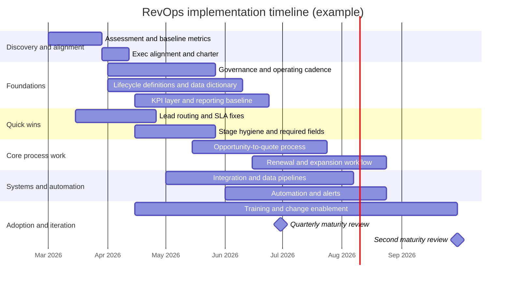

# RevOps-Insight
# Revenue Operations (RevOps)

## Executive summary

I treat Revenue Operations (RevOps) as an operating model—more than a team—built to make revenue execution **predictable, measurable, and improvable** across the full customer lifecycle. The most credible research definitions converge on four themes: **cross-functional alignment**, **shared data and process standards**, **technology + automation**, and **governance that sustains change**. 

This README-style write-up is intentionally **size- and industry-agnostic** . Many published RevOps benchmarks come from **mid-to-large organizations** (e.g., a 927-respondent Forrester Consulting survey spanning 500+ employee firms, primarily US/Europe/APAC), so calibrate expectations and sequencing for smaller or earlier-stage teams.

If you want one mental model: **RevOps is the system that turns the revenue “machine” from a set of siloed departments into a measurable, governed workflow—from first touch to expansion—so leaders can diagnose bottlenecks, automate repeatable work, and allocate investment with confidence**. 

## Definitions and core objectives

**Authoritative definitions (what RevOps is):**

- entity["company","Gartner","research advisory firm"] defines revenue operations as the **convergence of marketing, sales, and customer service**. citeturn0search0  
- entity["company","Forrester","research and advisory firm"] defines RevOps as a **highly configured, iterative commercial execution strategy** designed to maximize customer value and company performance, unifying and optimizing **data, processes, technology, and talent** across the lifecycle. citeturn18search0
- entity["company","Forrester Consulting","consulting arm of forrester"] (in a large survey-based maturity study) defines revenue operations as the **strategic and organizational alignment** of resources, people, processes, and technologies that convert prospects to customers and maximize lifetime value. citeturn3view0  


**Core objectives (what RevOps exists to accomplish):**

RevOps is typically justified on four outcome classes that show up consistently across research:

- **Efficiency:** reduce duplicated effort, manual work, and process friction across handoffs. citeturn18search1  
- **Predictability:** improve the reliability of pipeline, forecasting, conversion, and renewal outcomes through defined milestones and monitoring. citeturn18search1turn5search37  
- **Data integrity and a single source of truth:** standardize lifecycle definitions and consolidate customer/revenue data into trusted systems with governance. citeturn7view0turn18search1  
- **Lifecycle alignment (acquisition → retention → growth):** ensure the company can coordinate across routes-to-market, and avoid leaving “billing/finance” out of the customer experience. 

**Why the timing matters (adoption signal):** Gartner’s public guidance has repeatedly pointed to rapid adoption among high-growth companies (e.g., “75% of the highest growth companies” deploying a RevOps model by 2025). 

## Org models, frameworks, and scope

### A practical framework I use

I organize RevOps in a way that maps cleanly to implementation and governance:

- **People:** ownership, decision rights, staffing, and enablement. citeturn18search0turn18search1  
- **Process:** standardized lifecycle definitions and handoffs (lead → opportunity → contract/subscription → renewal/expansion). citeturn18search1turn3view0  
- **Data:** a shared measurement layer (definitions, data dictionary, data contracts) and quality controls. citeturn7view0turn18search1  
- **Technology:** an integrated stack that supports the lifecycle and minimizes revenue leakage. citeturn18search1turn19view0  

This is consistent with research characterizations of RevOps as an execution strategy that unifies data/process/tech/talent, not merely an org chart change. 

### Org models and how to choose

Research is explicit that there’s **no single correct structure**: bigger firms may lean toward federated models, while scaling firms may find centralized easier at the start. citeturn20view0

Below is the comparison table I recommend keeping in your README for quick alignment.

| Org model | What it looks like | Best when | Advantages | Tradeoffs / failure modes | How I mitigate the risks |
|---|---|---|---|---|---|
| Centralized | One RevOps leader/team owns cross-functional systems, governance, analytics, and core processes; functions are served via intake/prioritization | Early RevOps adoption, high need for standardization, heavy tooling debt, unclear ownership | Fast standardization, stronger data governance, clearer accountability, fewer duplicate tools/processes | Can become a “ticket desk”; slower in edge cases; risk of being perceived as distant from frontline needs | Strong operating rhythm with GTM leaders; explicit SLAs; embedded liaisons; publish a public backlog |
| Pod / embedded | RevOps practitioners embed into GTM pods (by segment/region/product), often aligned tightly to execution | Highly segmented GTM motions (e.g., SMB vs enterprise), rapid experimentation, high context needs | Faster iteration; higher empathy with frontline; better adoption of changes | Risk of inconsistent definitions; duplicated tooling; data fragmentation | Maintain a RevOps “center of excellence” for data, systems, and standards; enforce shared metrics definitions |
| Hybrid (central + pods) | Central platform/data/governance team plus embedded ops in functions/pods; shared standards with localized execution | Most scaling orgs; multiple motions; need both governance and speed | Balances standardization and local agility; reduces duplication; improves lifecycle coordination | Matrix complexity; unclear decision rights unless documented | Written decision rights (RACI); architecture standards; quarterly audits; consistent KPI definitions |

The “pod” and “hybrid” ideas are compatible with Forrester’s guidance that teams may not fully merge, but must align operating principles across marketing, sales, customer success/support, and finance. 

image_group{"layout":"carousel","aspect_ratio":"16:9","query":["revenue operations revops framework diagram","revops operating model people process data technology diagram","lead to cash process diagram revenue operations","customer lifecycle funnel marketing sales customer success"],"num_per_query":1}

### Scope and functions included

RevOps scope varies, but the most defensible boundary is: **anything required to operate the revenue lifecycle as a single measurable system**. In practice that often includes:

**Sales operations responsibilities** (acquisition / pipeline mechanics)
- Territory and capacity planning; quota methodology; pipeline coverage and deal stage governance.
- Forecast process design (inputs, rollups, inspection cadences) and forecast accuracy tracking. citeturn5search37turn5search8  
- Sales process enablement: stage definitions, qualification criteria, required fields, activity standards.

**Marketing operations responsibilities** (demand system)
- Lifecycle definitions (lead stages), source attribution conventions, routing/SLAs, and automation.
- Campaign measurement and CAC instrumentation (at least “directionally accurate” and consistently defined). citeturn4search8  

**Customer success operations responsibilities** (retention / expansion system)
- Standardized health scoring inputs, renewal workflows, churn taxonomy, and expansion plays.
- NRR/GRR definitions and calculations; churn measurement and root-cause analysis. citeturn5search15turn4search6  

**Finance / analytics responsibilities** (revenue truth and monetization operations)
- Revenue reporting alignment with GTM definitions; revenue leakage controls; ARR/MRR governance for subscription businesses.
- Billing operations and finance involvement are frequently emphasized as part of a complete RevOps journey (not an afterthought). citeturn19view0turn4search11  

A tight rule I use: if the process affects **conversion, retention, or customer lifetime value**, it’s in scope—even if execution sits in another function. citeturn3view0turn19view0

## Metrics and data foundations

### Metric system principles

RevOps metrics fail when teams treat them as departmental scorecards rather than a **single revenue system**. The Forrester Consulting maturity research uses “single source of truth,” “unified goals,” and cross-team alignment as maturity discriminators, which aligns with my experience: metrics scale when definitions and data ownership are centralized and governed. citeturn7view0turn22view0

I recommend structuring your metrics into three layers:

- **Outcome metrics** (what the business wants): ARR/MRR growth, retention, expansion, revenue growth.
- **System health metrics** (how the machine works): conversion rates, stage velocity, pipeline coverage, churn, forecast accuracy.
- **Input/control metrics** (leading indicators): SLA compliance, data completeness, activity-to-opportunity conversion, time-to-first-response, billing exceptions.

### KPIs to track (with usable definitions)

Below are the KPIs you explicitly requested, with definitions that are precise enough to document and govern.

**Revenue growth**
- Growth is commonly tracked as period-over-period revenue change; Forrester Consulting’s maturity table shows materially different growth levels between maturity cohorts in its sample (e.g., higher five-year average growth in higher maturity). 

**CAC (Customer Acquisition Cost)**
- CAC is typically calculated as **sales + marketing expenses divided by new customers acquired** in the period; the key is defining “eligible spend” and what counts as an “acquired customer.” citeturn4search8  

**LTV / CLV (Customer Lifetime Value)**
- CLV is generally the total value (or profit) expected from a customer over the full relationship; you must document whether your formula is revenue-based or margin-based. citeturn4search9  

**Churn**
- Customer churn rate is the percentage of customers who discontinue within a period; revenue churn tracks lost revenue from cancellations/downgrades. citeturn4search6turn4search38  

**Sales cycle length**
- A standard definition is average time-to-close across closed deals; Salesforce describes it as total days to close divided by closed deals (ensure you define the start/end timestamps). citeturn5search2  

**Pipeline coverage**
- Pipeline coverage compares pipeline value to a target for the period (often expressed as “X times quota/target”). citeturn5search8  

**Forecast accuracy**
- Forecast accuracy should be defined consistently (e.g., absolute percentage difference between forecast and actual results); Forrester has published guidance on consistently grading forecast accuracy. 

**ARR / MRR**
- ARR and MRR are recurring revenue summaries at annual vs monthly horizons; Stripe provides a clear distinction and usage guidance. citeturn4search11  

**Expansion revenue**
- Expansion is revenue gained from upsell/cross-sell/upgrade among existing customers and is a core component of net retention calculations. citeturn5search11turn5search15  

### Data model essentials

Your RevOps data model should be documented with the same seriousness as an API contract. At minimum, I recommend standardizing:

- **Entities:** account, contact, lead, opportunity, product, contract, subscription, invoice/payment, activities/interactions.
- **Lifecycle states:** lead stages, opportunity stages, customer status, renewal status, churn status.
- **Event timestamps:** created, qualified, stage-changed, closed-won/lost, contract start, renewal date, expansion date.
- **Attribution rules:** first-touch vs multi-touch, opportunity influence windows, “source of truth” precedence rules.

The maturity research emphasizes that high-maturity orgs are more likely to have a single customer data source and fewer systems used for customer data—both pointing to why the data model and system-of-record decisions are foundational work. citeturn7view0turn18search1  

## Tooling and tech stack

This section is intentionally “examples, not prescriptions.” Your optimal stack depends on GTM motion (PLG vs SLG vs channel), data maturity, and existing contracts. Still, most RevOps stacks converge toward a familiar reference architecture:

- **System of record (CRM)**
- **Engagement and orchestration (sales engagement / revenue orchestration)**
- **Revenue intelligence (conversation + pipeline insights)**
- **Quote-to-cash (CPQ, billing/subscription, payments)**
- **Data + BI (warehouse, semantic layer, dashboards)**
- **Integration layer (iPaaS / ELT)**

A related market concept is Forrester’s “revenue orchestration platforms,” defined as technology enabling teams to design/execute/capture/analyze/improve buyer and customer engagement while optimizing internal revenue processes. 

### Tool examples with official links

| Layer | Vendor examples | Official links |
|---|---|---|
| CRM | entity["company","Salesforce","crm vendor"]; entity["company","HubSpot","crm and marketing platform"]; entity["company","Microsoft","enterprise software company"] (Dynamics 365 Sales) | `https://www.salesforce.com/` · `https://www.hubspot.com/` · `https://www.microsoft.com/en-us/dynamics-365/products/sales` |
| RevOps / revenue orchestration | entity["company","Clari","revenue orchestration platform"]; entity["company","LeanData","revenue operations and routing"] | `https://www.clari.com/` · `https://www.leandata.com/` |
| GTM orchestration (sales engagement / workflows) | entity["company","Outreach","sales execution platform"]; entity["company","Salesloft","revenue orchestration platform"] | `https://outreach.io/` · `https://www.salesloft.com/` |
| Revenue intelligence | entity["company","Gong","revenue intelligence platform"]; entity["company","People.ai","ai revenue platform"] | `https://www.gong.io/` · `https://www.people.ai/` |
| Analytics / BI | entity["company","Tableau","business intelligence software"]; entity["company","Google Cloud","cloud platform provider"] (Looker / Looker Studio); (Power BI via Microsoft) | `https://www.tableau.com/` · `https://cloud.google.com/looker` · `https://www.microsoft.com/en-us/power-platform/products/power-bi` |
| Data warehouse / lakehouse | entity["company","Snowflake","cloud data platform"] | `https://www.snowflake.com/en/` |
| Integration / automation (iPaaS) | entity["company","Workato","integration and automation platform"] | `https://www.workato.com/` |
| CPQ | (Salesforce CPQ); entity["company","DealHub","cpq and quote-to-revenue"] | `https://www.salesforce.com/sales/cpq/` · `https://dealhub.io/` |
| Billing / subscription management | entity["company","Stripe","payments and billing platform"] (Stripe Billing); entity["company","Chargebee","subscription billing platform"] | `https://stripe.com/billing` · `https://www.chargebee.com/billing/` |

Example vendor pages for the above categories are available via their official sites. citeturn9search0turn9search5turn9search2turn9search3turn10search2turn10search3turn12search0turn12search5turn12search2turn12search3turn13search3turn11search21turn11search0turn11search1turn11search2turn13search0turn13search1  

## Implementation roadmap and playbook

### A staged roadmap I recommend

A recurring finding in the maturity-guidance research is that there is “no one right” org design; the starting point can be a process audit, cross-ops partnership, or integrating ops teams incrementally. citeturn20view0turn18search1  

I implement RevOps in seven workstreams that run in parallel but are sequenced:

1. **Assessment and baseline**
   - Inventory systems, lifecycle definitions, handoffs, and KPI inconsistencies.
   - Establish baseline metrics quality: completeness, duplication, timestamp reliability.

2. **Quick wins (first 30–60 days)**
   - Fix routing, SLAs, and the “top 3” reporting pain points.
   - Standardize one critical lifecycle definition set (e.g., MQL→SQL→SAO or qualified→pipeline→closed).

3. **Governance and operating rhythm**
   - Decision rights: what RevOps decides, what GTM leaders decide, escalation rule.
   - Weekly operating review with shared dashboards; monthly KPI deep dives; quarterly planning.

4. **Data model + measurement layer**
   - Data dictionary, metric definitions, and an “analytics contract” (what fields are required, by what stage, enforced how).
   - Single source of truth posture (even if technically distributed): define canonical objects and authority.

5. **Process redesign**
   - Lead-to-opportunity handoff; opportunity stage governance; quote-to-cash flow; renewal/expansion handoff.
   - Add observability: stage aging alerts, SLA breach alerts, churn-risk triggers.

6. **Tooling alignment and automation**
   - Reduce tool overlap; integrate remaining tools via iPaaS/ELT; enforce standard events.
   - Automate the repetitive work: enrichment, routing, reminders, renewal workflows.

7. **Change management and enablement**
   - Publish “what changed, why, and how to use it.”
   - Train frontline teams; measure adoption; iterate.

This sequencing aligns to research emphasis that RevOps is a cultural/operating shift rather than an org-label change, and that strong collaboration + a single trusted customer data source are required to consistently realize benefits. citeturn22view0turn7view0turn18search0  

### Sample 12-month timeline (Mermaid Gantt)



Empirically, standing up a RevOps function is often reported as taking **six months to two years**, and maturity is correlated with tenure—but organizations across maturity cohorts reported similar time-to-stand-up ranges. citeturn3view2  

### Sample OKRs (drop-in template)

```text
Objective: Make revenue execution predictable by standardizing lifecycle, data, and forecasting.

KR1: Publish and adopt a single set of lifecycle definitions (lead, opportunity stages, customer status),
     with <5% “unknown stage” records weekly.

KR2: Improve CRM critical-field completeness to 95%+ at each stage gate
     (e.g., ICP fit, use case, next step, close date, amount).

KR3: Improve forecast accuracy to within an agreed threshold for 2 consecutive quarters.

KR4: Reduce median sales cycle length by X% while maintaining win rate.

KR5: Increase net revenue retention by Y points through improved renewal risk visibility and expansion plays.

KR6: Establish weekly operating review cadence with published dashboards and documented action items.
```

The specific targets (X/Y/thresholds) must be set relative to your baseline and motion; the key is that RevOps success should be measurable in both **system mechanics** (data/process) and **outcomes** (growth, retention, predictability). citeturn18search1turn5search37turn5search2turn5search15  

## Evidence and ROI

### Empirical evidence from reputable industry research

**Revenue impact and maturity effects**
- In Forrester Consulting’s maturity study, higher maturity cohorts report higher observed revenue growth (including higher five-year average growth) versus lower maturity cohorts. citeturn7view0  
- The same study reports that organizations with RevOps functions experienced a larger revenue growth uplift than pre-adopters expected, with reported pre/post comparisons indicating an uplift on the order of **a few percentage points** in the sample. citeturn7view1turn7view2  

**Operational benefits**
- Respondents cite benefits like more robust planning, improved productivity, and increased win rates; highly mature teams are more likely to report these benefits, and the report emphasizes that RevOps is a cultural shift—not “a team in name only.” citeturn22view0turn3view1  

**Adoption and momentum signals**
- Gartner projected broad adoption among high-growth companies (widely cited as 75% by 2025). citeturn1search0  
- LeanData’s large survey program reported rapid increases in organizations building or establishing RevOps groups year-over-year (e.g., increases in organizations with dedicated RevOps groups and those actively building one). citeturn8search4  

### Typical ROI ranges and how I frame them

Because “RevOps ROI” blends **revenue lift** (growth, retention, expansion) with **cost and productivity** (fewer manual steps, fewer errors, less leakage), the most defensible way to state ROI is to separate:

- **Operating model impact (RevOps as a function):** Forrester Consulting’s survey shows measurable revenue-growth uplift after adopting RevOps in its sample, and maturity cohorts show materially different growth levels—suggesting that benefits scale with deeper alignment (not merely creating the team). citeturn7view2turn22view0turn7view0  
- **Technology ROI (RevOps platforms/tools):** Forrester TEI-style studies often report large ROI figures for specific platforms. For example, Forrester TEI material published for Clari describes substantial ROI and payback claims for the platform (tool ROI, not “RevOps org” ROI). citeturn15search8turn9search3  

My recommendation for a README is to avoid overpromising (“RevOps delivers X% always”) and instead document:
- the **baseline metrics**,  
- the **mechanisms** you will change (definitions, routing, forecasting, renewals), and  
- the **expected directionality** (e.g., fewer SLA breaches, better data completeness, tighter forecast variance, improved retention signals).  

That keeps the repository rigorous and auditable, and aligns with research caution that org design alone is insufficient without new capabilities, processes, and governance. citeturn22view0turn20view0  

### A note on analytics and retention evidence

Even if you don’t deploy sophisticated ML, it’s worth noting that peer-reviewed work continues to show high predictive performance is feasible in churn-risk modeling contexts (e.g., CRM-integrated churn prediction frameworks achieving high classification metrics on standard datasets). This supports why CS Ops analytics and data foundations matter in a RevOps program. citeturn8search26  

## Open-source repository blueprint

This section is designed so you can lift it directly into a repo.

### Recommended README structure

GitHub users expect a README to answer: **What is this, who is it for, how do I use it, and how do I contribute?** I recommend:

```text
# RevOps Handbook (Open Source)

## Why this repo exists
## What RevOps means in this repo (definitions + scope boundary)

## Operating model
- Org model options (centralized, pod, hybrid)
- Decision rights (RACI)
- Operating cadence

## Metrics and data
- North-star metrics
- Metric definitions (data dictionary)
- Dashboards and reporting conventions

## Processes
- Lead-to-opportunity
- Opportunity-to-quote
- Quote-to-cash
- Renewal and expansion

## Tooling reference architecture
- Stack patterns
- Integration principles
- Security and access

## Implementation playbook
- Phased roadmap
- Templates
- Sample OKRs

## Contributing
## License
```

### Suggested repo layout

```text
.
├── README.md
├── LICENSE
├── CONTRIBUTING.md
├── CODE_OF_CONDUCT.md
├── SECURITY.md
├── docs/
│   ├── glossary.md
│   ├── lifecycle-definitions.md
│   ├── metrics/
│   │   ├── metric-catalog.md
│   │   └── metric-definition-template.md
│   ├── data/
│   │   ├── data-dictionary.md
│   │   └── event-schema.md
│   ├── governance/
│   │   ├── decision-rights-raci.md
│   │   └── change-control.md
│   └── processes/
│       ├── lead-to-opportunity.md
│       ├── opportunity-management.md
│       └── renewal-expansion.md
└── .github/
    ├── ISSUE_TEMPLATE/
    │   ├── bug_report.yml
    │   └── feature_request.yml
    └── pull_request_template.md
```

### Templates you can copy-paste

**Metric definition template**

```markdown
# Metric: <name>

## Owner
- DRI:
- Stakeholders:

## Business question
- What decision does this metric support?

## Definition
- Numerator:
- Denominator:
- Inclusion criteria:
- Exclusion criteria:

## Grain
- Account / opportunity / customer / subscription / day / month:

## Calculation rules
- Time window:
- Currency normalization:
- Treatment of refunds, credits, downgrades:

## Data sources
- System(s):
- Table(s)/object(s):
- Required fields:

## Data quality checks
- Completeness threshold:
- Freshness SLA:
- Known caveats:

## Visualization standard
- Preferred chart type:
- Segments/cuts:
- Alert thresholds:
```

**Issue templates and PR templates**

GitHub supports issue templates (including YAML issue forms) under `.github/ISSUE_TEMPLATE/` and pull request templates stored in `.github/pull_request_template.md` (or other documented paths). citeturn14search0turn14search1turn14search12  

`./.github/ISSUE_TEMPLATE/feature_request.yml`
```yaml
name: Feature request
description: Propose a new RevOps template, metric, or process artifact
title: "[Feature]: "
labels: ["enhancement"]
body:
  - type: textarea
    id: problem
    attributes:
      label: Problem statement
      description: What problem are you solving for RevOps practitioners?
    validations:
      required: true
  - type: textarea
    id: proposal
    attributes:
      label: Proposal
      description: Describe the artifact you want to add or change.
    validations:
      required: true
  - type: textarea
    id: sources
    attributes:
      label: Sources
      description: Link primary/official sources or reputable reports supporting the change.
    validations:
      required: false
```

`./.github/pull_request_template.md`
```markdown
## Summary
What does this PR change?

## Why
What problem does it solve? Link issues.

## What changed
- [ ] Docs
- [ ] Templates
- [ ] Metrics definitions
- [ ] Process guidance

## Evidence
Links to sources, screenshots, or examples.

## Checklist
- [ ] I followed the repo style and structure
- [ ] I added/updated citations where relevant
- [ ] I updated docs/index or README if needed
```

### Licensing suggestions

To be unambiguously open source, you should include a license file; GitHub documentation explicitly notes that a repository needs a license so others can freely use, modify, and distribute it. citeturn18search3turn18search7  

I typically recommend choosing from a small set of well-understood licenses and documenting the rationale:

- **Permissive (common default):** MIT or Apache-2.0  
- **Stronger reciprocity (copyleft):** GPL-3.0 (when you want derivatives to remain open)

For a quick, credible reference set:
- entity["organization","Open Source Initiative","osi licenses authority"] maintains the OSI-approved license list. citeturn14search11  
- entity["organization","Apache Software Foundation","apache open source foundation"] publishes the canonical Apache-2.0 license text and SPDX identifier. citeturn14search15  
- entity["organization","Choose a License","github open source license guide"] provides practical, non-judgmental license selection guidance. citeturn14search6turn14search2  

### Contribution guidance (high signal, low friction)

I’ve found open-source RevOps repos stay healthy when contributions are anchored to:
- **Artifacts, not opinions:** every new metric/process template should include scope, owner, and a “why” section.
- **Traceable sources:** prefer primary sources and reputable research; link them in PRs/issues.
- **Versioning:** treat lifecycle definitions and metric dictionaries as versioned contracts; document breaking changes in a changelog.

GitHub’s own documentation around adding a license and configuring templates can be referenced directly in the repo’s “Contributing” section to reduce ambiguity for contributors. citeturn14search0turn14search1turn18search7
